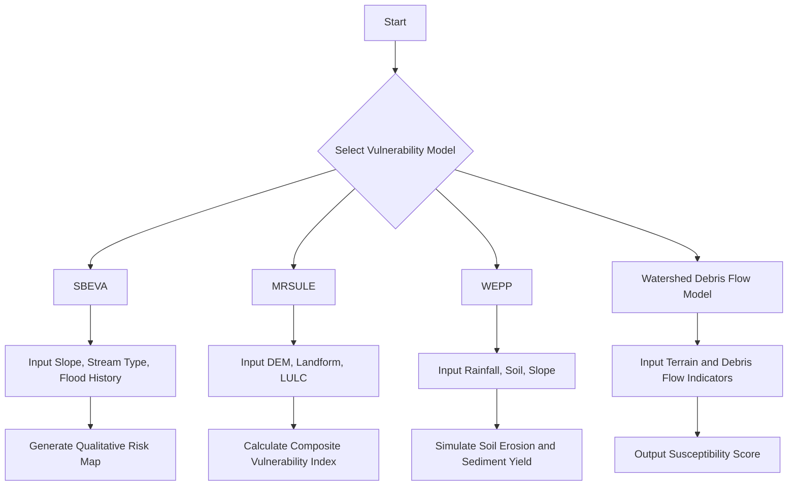

# Chapter 3: Methodology

Welcome to the third chapter of our documentation! This chapter provides a detailed exaplanation of the methodlogies used in this analysis, data-pipeline architecture and implementation in the CULVERT Application.

---

## Culvert Vulnerability Assessment Application

The **Culvert Vulnerability Assessment App** is a comprehensive geospatial tool designed to evaluate the hydrologic and hydrogeomorphologic vulnerability of culverts and related infrastructure. It integrates watershed delineation, hydrologic analysis, and terrain-based assessment methods to support infrastructure planning, disaster resilience, and environmental safety.

---

## Table of Contents

1. [Watershed Delineation](#1-watershed-delineation)
2. [Hydrologic Vulnerability Assessment](#2-hydrologic-vulnerability-assessment)
3. [Hydrogeomorphologic Vulnerability Assessment](#3-hydrogeomorphologic-vulnerability-assessment)

---

## 1. Watershed Delineation

This module allows users to delineate watershed boundaries and stream networks based on elevation data and infrastructure locations such as culverts, bridges, and fords.

### 🧭 Steps in Watershed Delineation

1. **Boundary Region (Mandatory)**

   - Input type: `.zip` (shapefile) or `.shp`
   - Defines the outer limits of the study region.

2. **DEM Data Raster (Mandatory)**

   - Input type: `.tif`
   - Digital Elevation Model is used for flow direction and accumulation analysis.

3. **Pour Point Data (Optional)**

   - Examples: Culverts, bridges, fords, or any outlet points.
   - Enhances precision in delineating watershed boundaries to real-world infrastructure.

4. **Stream Delineation Parameters (Mandatory)**

   - Example parameters:
     - Flow accumulation threshold
     - Minimum stream length

5. **Hydro-Enforcement Parameters (Optional)**
   - Placeholder parameters:
     - Sink filling method
     - Stream burning depth
     - Depression breaching
     - Culvert insertion method

### 📊 Flow Diagram

```mermaid
flowchart TD
    A[Start] --> B[Upload Boundary Region (.zip/.shp)]
    B --> C[Upload DEM Raster (.tif)]
    C --> D[Add Pour Point Data (Optional)]
    D --> E[Set Stream Delineation Parameters]
    E --> F[Set Hydro-Enforcement Parameters (Optional)]
    F --> G[Run Delineation]
    G --> H[Generate Watershed and Stream Network]
```

---

## 2. Hydrologic Vulnerability Assessment

This module assesses the hydrologic capacity and risk associated with culverts using rainfall-runoff relationships and statistical discharge estimation methods.

### 🔬 Methods

#### 2.1 Regional Frequency Analysis (RFA)

- **Inputs Required:**

  - Stream gauge discharge data (mandatory)
  - Precipitation data (optional; required for non-stationary analysis)

- **Outputs:**

  - Estimated design discharges for different return periods.

#### 2.2 Rational Method

- **Inputs:**

  - Watershed area
  - Runoff coefficient
  - Precipitation data:

    - NOAA Atlas 14
    - EPA Future PIDF
    - On-site precipitation data

- **Outputs:**

  - Peak discharge based on intensity-duration-frequency data.

#### 2.3 Graphical Peak Discharge Method

- **Inputs:**

  - Drainage area
  - Soil type and land use
  - Precipitation source:

    - NOAA Atlas 14
    - EPA Future PIDF
    - On-site precipitation

- **Outputs:**

  - Peak discharge using graphical tools and empirical curves.

### 📊 Flow Diagram

```mermaid
flowchart TD
    A[Start] --> B{Select Method}
    B --> C1[Regional Frequency Analysis]
    C1 --> D1[Upload Stream Gauge Data]
    D1 --> E1[Add Precipitation (Optional)]
    E1 --> F1[Run Non-Stationary/Stationary Analysis]

    B --> C2[Rational Method]
    C2 --> D2[Select Precipitation Source]
    D2 --> E2[Enter Runoff Coefficient & Area]
    E2 --> F2[Calculate Peak Discharge]

    B --> C3[Graphical Peak Discharge Method]
    C3 --> D3[Input Area, Soil, Land Use]
    D3 --> E3[Select Precipitation Data]
    E3 --> F3[Use Empirical Graphs for Discharge]
```

---

## 3. Hydrogeomorphologic Vulnerability Assessment

This module evaluates vulnerability due to terrain, sediment, debris flow, and erosion characteristics at the culvert site and upstream watershed.

### 📉 Models

#### 3.1 SBEVA (Stream-Based Environmental Vulnerability Assessment)

- **Type:** Qualitative
- **Approach:** Uses expert scoring and geomorphic parameters.
- **Factors:**

  - Stream slope
  - Proximity to infrastructure
  - Historical flood data

#### 3.2 MRSULE (Multi-Risk Scoring Using Landform and Elevation)

- **Type:** Quantitative
- **Input:**

  - DEM
  - Landform classification
  - Land use data

- **Output:**

  - Composite vulnerability index map.

#### 3.3 WEPP (Water Erosion Prediction Project)

- **Type:** Quantitative
- **Input:**

  - Precipitation
  - Soil properties
  - Land cover and slope

- **Output:**

  - Soil erosion and sediment yield

#### 3.4 Watershed Debris Flow Model

- **Type:** Qualitative
- **Input:**

  - Terrain steepness
  - Stream density
  - Historical debris flow data

- **Output:**

  - Debris flow susceptibility rating

### 📊 Flow Diagram



---

## ✅ Summary

The **Culvert Vulnerability App** provides a comprehensive geospatial decision-support system with three integrated modules:

- **Watershed Delineation:** Data-driven delineation of upstream hydrologic networks.
- **Hydrologic Assessment:** Quantifies runoff risks using multiple hydrologic models.
- **Hydrogeomorphologic Assessment:** Evaluates terrain-driven vulnerabilities using both qualitative and quantitative models.

It supports climate-resilient infrastructure planning by integrating hydrologic and geomorphologic modeling at various spatial scales.

---

## 🛠️ Future Enhancements (Placeholders)

- Auto-fetching of precipitation data from NOAA/EPA APIs.
- Real-time hydro-enforcement visualization.
- Integration with infrastructure inventory databases.
- AI-powered scoring system for qualitative models like SBEVA.

---
